# AutoFormFiller — Complete Antigravity IDE Implementation Prompt

> **How to use this document**: This is a single, self-contained build specification. Paste it into Antigravity IDE as the project brief, or feed it section-by-section as prompts. Section 12 contains the literal step-by-step build instructions for the IDE agent. Everything before that is the reasoning and spec the agent should treat as ground truth when it makes implementation decisions.

**Build profile selected**: Production MVP with real government/institutional form integrations · cheapest viable storage (self-hosted/S3-compatible, recommendation below) · local/open-source LLMs only (near-zero inference cost) · India-first compliance (DPDP Act 2023) with GDPR-compatible design.

---

# 1. Product Requirements Document (PRD)

## 1.1 Problem Statement

Indians fill the same set of facts — name, father's name, DOB, Aadhaar number, address, caste category, income, marks — into dozens of unrelated forms every year: scholarship portals, entrance exams, government scheme applications, job portals, passport renewal, bank KYC, insurance proposals. Each portal has its own layout, its own document upload rules, its own quirks (photo size in KB, signature in a specific aspect ratio, self-attestation requirements). The result is repetitive, error-prone manual data entry, frequent rejections due to mismatched formatting, and a high abandonment rate for scheme applications that genuinely benefit the applicant (especially students and rural users with low digital literacy).

AutoFormFiller solves this by becoming the single place a person uploads their identity and supporting documents once. An AI agent layer extracts structured data from those documents, builds one canonical profile, and reuses that profile to fill out any new form — government, institutional, or web-based — asking the user only for the small residue of information that genuinely isn't in their document set yet (e.g. "preferred exam center" or "bank account for refund").

## 1.2 Target Users

- Students applying to multiple scholarships, entrance exams, and college admissions in a single season.
- Job seekers filling repetitive application forms across portals.
- Citizens applying for government welfare schemes (income certificate, caste certificate–based schemes, ration card, etc.) who are often the least equipped to navigate complex forms.
- Gig workers / first-time bank or insurance customers completing KYC-heavy onboarding.
- Family "form-fillers" — a literate family member who handles paperwork for parents/grandparents/relatives and currently re-types the same Aadhaar/PAN details for everyone, every time.

## 1.3 User Personas

**Persona 1 — Ananya, 19, undergraduate applicant.**
Applying to 12 scholarship schemes and 3 entrance exams in one admission cycle. Has Aadhaar, 10th/12th marksheets, income certificate, caste certificate, passport photo. Wants to upload once and have every form pre-filled, with a clear list of what's still missing per form.

**Persona 2 — Suresh, 34, primary breadwinner navigating a government welfare scheme.**
Limited digital literacy, prefers mobile, distrustful of "yet another app asking for Aadhaar." Needs very clear consent screens, large touch targets, and a human-review step before anything is actually submitted.

**Persona 3 — Priya, 27, HR-adjacent job seeker.**
Applies to 20+ job postings a month across different ATS portals (some are clean web forms, some are PDFs to email back). Wants resume-adjacent fields (education, employment history, addresses) auto-filled and wants application status tracked centrally.

**Persona 4 — Rakesh, 58, family form-filler for elderly parents.**
Manages document vaults for 3-4 family members. Needs strict profile isolation per family member, an easy "switch profile" UX, and assurance that one relative's Aadhaar isn't visible when filling another's form.

## 1.4 User Stories

- As a user, I want to upload a document once (e.g. Aadhaar) and have the system extract my name, DOB, address, and Aadhaar number automatically, so I never retype it.
- As a user, I want to know whether an extracted document is likely genuine/unmodified before it's used to fill a legally significant form.
- As a user, I want a single "profile" view showing every field the system knows about me, where each field came from, and how confident the system is.
- As a user, I want to point the system at a new form (PDF or a URL) and have it tell me, before filling anything, which fields it can fill and which it cannot.
- As a user, I want the system to only ask me for the fields it genuinely doesn't have — not re-ask for things already in my profile.
- As a user, I want to review and edit every auto-filled value before submission; nothing should auto-submit without my explicit confirmation by default.
- As a user, I want to see the status of every application I've made through the platform in one dashboard.
- As a user, I want assurance — backed by actual architecture, not just a privacy policy paragraph — that my Aadhaar and other sensitive documents are encrypted and never used to train any shared model.
- As an admin/family manager, I want to manage multiple linked profiles (e.g. dependents) under one account with clear access boundaries.
- As a user, I want to revoke the platform's access to a specific document or delete my account and have my data actually purged (DPDP "right to erasure").

## 1.5 Functional Requirements

**FR-1 Document Vault**: Upload, store, version, and categorize identity/supporting documents (image or PDF). Support replace-on-expiry (e.g. updated income certificate).

**FR-2 Extraction**: OCR + structured field extraction per document type (Aadhaar, PAN, Passport, Driving License, marksheets, caste/income certificates, utility bills, medical documents).

**FR-3 Document Classification**: Automatically detect document type on upload (don't require the user to tag it, though allow override).

**FR-4 Authenticity / Verification**: Run heuristic + model-based checks (tamper detection, font/layout consistency, checksum validation for Aadhaar via Verhoeff algorithm, QR/barcode decode where present, MRZ checksum for passports) and produce a confidence/flag rather than a binary "real/fake" claim (the system is not a legal authority on document authenticity).

**FR-5 Unified Profile**: Merge extracted fields from all documents into one canonical user profile with field-level provenance (which document produced this value) and conflict resolution when two documents disagree (e.g. name spelling differs between Aadhaar and PAN).

**FR-6 Form Ingestion**: Accept a target form as a PDF upload or a URL. Parse form fields/structure (PDF form fields via AcroForm/XFA, or DOM form fields for web forms).

**FR-7 Field Mapping**: Map target form fields to profile fields using a rule engine first, falling back to embedding-based semantic matching, then a small local LLM for ambiguous labels.

**FR-8 Auto-Fill**: Populate a fillable copy of the form (PDF) or drive a guided browser-fill flow (web form) with mapped values.

**FR-9 Document Auto-Attach**: Where a form requires document uploads (photo, signature, Aadhaar copy), automatically attach the correct stored document, resized/converted to the form's stated spec (file size, dimensions, format) where determinable.

**FR-10 Gap Detection**: Identify fields with no confident mapping and present them as a short, plain-language form to the user — nothing else.

**FR-11 Human Review Gate**: Before any submission (and especially before any automated web-form submission), present a diff/summary screen requiring explicit user confirmation.

**FR-12 Application Tracking**: Store every filled/submitted application with status (Draft, Filled, Awaiting Review, Submitted, Under Process, Approved, Rejected) and timeline, with manual status update support where no tracking API exists.

**FR-13 Consent & Access Log**: Every document read, every field used to fill a form, and every submission must be logged against explicit user consent for that action.

**FR-14 Multi-Profile / Family Mode**: One account can manage multiple distinct identity profiles with independent document vaults, isolated at the data layer (not just the UI layer).

**FR-15 Notifications**: Status changes, missing-document reminders, document-expiry reminders (e.g. income certificate validity).

## 1.6 Non-Functional Requirements

- **Security**: All sensitive fields (Aadhaar number, PAN, DOB, financial figures) encrypted at the column level, not just disk-level; documents encrypted at rest with per-user data encryption keys (DEKs) wrapped by a master key (KEK) — envelope encryption.
- **Privacy**: No document or extracted field is ever sent to a third-party model provider; all extraction/classification/filling inference runs on self-hosted open-source models. No training on user data, anywhere, ever — contractually and architecturally enforced (no provider with a "may train on inputs" default is used).
- **Compliance**: Architected against India's Digital Personal Data Protection Act, 2023 (DPDP) as the primary regime, with the same controls satisfying GDPR principles (lawful basis, purpose limitation, storage limitation, right to erasure, data portability) for any non-Indian users.
- **Low storage footprint**: Documents are stored once, compressed, deduplicated by hash; extracted text stored as structured rows, not duplicated blobs; model weights are quantized and shared across all users (no per-user fine-tuning).
- **Low cost**: No mandatory paid LLM API in the default deployment; infra sized to run a few hundred concurrent users on a single mid-size VPS.
- **Availability**: 99% target for MVP (single-region, with backup, not multi-region HA — that's a Phase 4 concern).
- **Auditability**: Every automated decision (classification, field mapping, authenticity flag) is logged with the model/version and confidence score that produced it, so a human reviewer can always see *why* the system did something.
- **Accessibility**: Forms and the review screen must work acceptably on a low-end Android device over 3G/4G; this rules out heavy client-side ML and argues for server-side inference.
- **Localization**: UI and OCR pipeline must support at minimum English + Hindi, with the extraction layer tolerant of bilingual documents (most Indian government documents are bilingual).

---

# 2. System Architecture

## 2.1 High-Level Architecture (Mermaid)

This formalizes the block diagram you sketched (Vault → Document Vault → Form Scanner/Extract → Rule Engine → Embedding Engine → Tiny LLM → Confidence Score → Human Review → Fill Form) into an explicit pipeline with feedback loops.

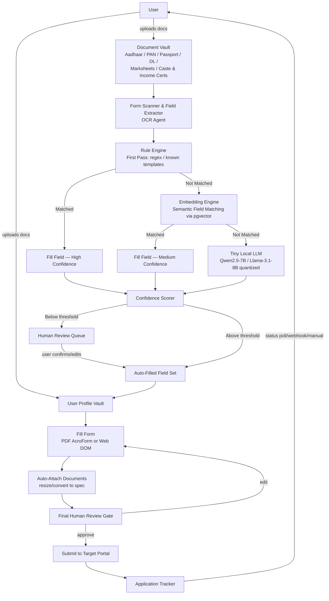

## 2.2 Component Diagram

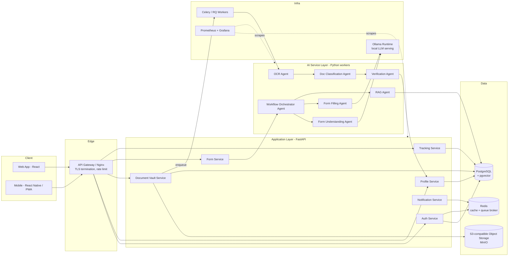

## 2.3 Data Flow Diagram

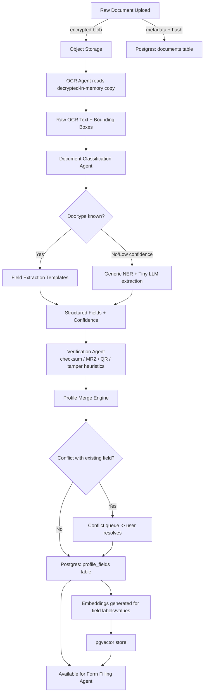

## 2.4 Agent Architecture

AutoFormFiller is built as a **multi-agent pipeline coordinated by a single Workflow Orchestrator**, not a free-roaming autonomous agent swarm. This is a deliberate choice: form-filling for legal/government documents needs deterministic, auditable steps, not open-ended agent autonomy. Each "agent" below is a bounded service with a fixed input/output contract; the LLM is used *inside* steps for specific sub-tasks (classification, semantic matching, ambiguous-field reasoning), not as the controller of the whole flow.

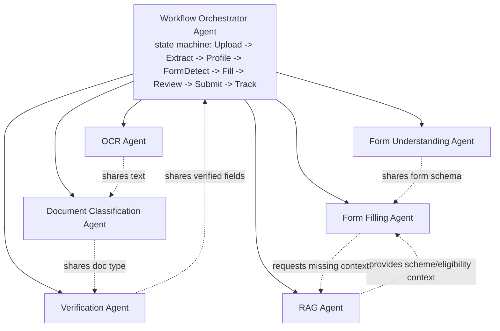

Each agent is **stateless between calls**; all state lives in Postgres, keyed by a `workflow_run_id`. This means any agent can be retried, replaced, or run on a different worker without losing context — important for both reliability and for keeping individual model context windows small (cost control).

---

# 3. AI Architecture

Each agent below is specified with **Inputs / Outputs / Tools / Memory / Prompt Template**, matching how Antigravity IDE should scaffold each as an independent service module.

## 3.1 OCR Agent

**Purpose**: Convert a raw document image/PDF into machine-readable text with positional metadata.

- **Inputs**: Document binary (image/PDF page), document_id, language hint (en/hi/auto).
- **Outputs**: `{ text: str, blocks: [{text, bbox, confidence}], language_detected, page_count }`
- **Tools**: PaddleOCR (primary, supports Hindi+English, runs CPU-friendly) or Tesseract 5 with `hin+eng` trained data as fallback; `pdf2image`/`pymupdf` for PDF page rasterization; OpenCV for deskew/denoise pre-processing.
- **Memory**: None (stateless per call). Result persisted to `document_extractions` table, not held in agent memory.
- **Prompt Template**: N/A — this agent is non-LLM (pure CV/OCR). No prompt; this is intentional for cost and determinism.

## 3.2 Document Classification Agent

**Purpose**: Determine document type (Aadhaar, PAN, Passport, DL, 10th Marksheet, 12th Marksheet, Caste Certificate, Income Certificate, Utility Bill, Medical Document, Other) from OCR text + visual layout.

- **Inputs**: OCR text + blocks from OCR Agent, thumbnail image.
- **Outputs**: `{ doc_type: str, confidence: float, alt_candidates: [{type, score}] }`
- **Tools**: Stage 1 — fast keyword/regex rule set (e.g. "Government of India" + 12-digit number pattern → Aadhaar candidate; "INCOME TAX DEPARTMENT" + 10-char alphanumeric → PAN). Stage 2 (only if Stage 1 confidence < 0.85) — small local LLM (Qwen2.5-7B-Instruct, 4-bit quantized via Ollama) given the OCR text snippet.
- **Memory**: None per-document; a small in-process cache of recent classification results keyed by document hash to avoid re-classifying identical re-uploads.
- **Prompt Template**:
```
SYSTEM: You classify Indian identity/supporting documents. Respond with ONLY one of:
AADHAAR, PAN, PASSPORT, DRIVING_LICENSE, MARKSHEET_10, MARKSHEET_12,
DEGREE_CERTIFICATE, CASTE_CERTIFICATE, INCOME_CERTIFICATE, UTILITY_BILL,
MEDICAL_DOCUMENT, GOVERNMENT_ID_OTHER, UNKNOWN
followed by a confidence score 0-1, comma separated. No other text.

USER: Document text excerpt:
"""
{ocr_text_excerpt}
"""
Classify this document.
```

## 3.3 Form Understanding Agent

**Purpose**: Parse a target form (PDF or web URL) into a structured schema of fields: label, expected type, required/optional, constraints (max length, regex, file spec for uploads).

- **Inputs**: Form PDF binary OR rendered DOM/HTML of a web form URL.
- **Outputs**: `{ form_id, fields: [{field_id, label, type, required, constraints, position}], upload_slots: [{slot_id, label, accepted_formats, max_size_kb, dimensions}] }`
- **Tools**: `pypdf`/`pikepdf` to read AcroForm field definitions directly when present (most reliable, no LLM needed); Playwright (headless) to render web forms and extract `<input>/<select>/<textarea>` elements with their `label`/`aria-label`/`placeholder`; for PDFs with **no** AcroForm fields (flat/scanned forms), fall back to OCR Agent output + a local LLM pass to infer field boundaries from layout text.
- **Memory**: Persists parsed schema to `form_templates` table keyed by a hash of the form (so a frequently-used scholarship PDF is parsed once, reused for every user).
- **Prompt Template** (used only for the flat/scanned-form fallback path):
```
SYSTEM: You extract a list of fillable fields from a government/institutional form's
raw text layout. For each field, give: label, likely_data_type (text/date/number/
enum/file_upload), and whether it appears mandatory (look for '*' or 'mandatory').
Return strict JSON list, no prose.

USER: Form text with line positions:
"""
{layout_text_with_line_numbers}
"""
```

## 3.4 Form Filling Agent

**Purpose**: Map the user's unified profile fields to the target form's schema and produce fill values, escalating only ambiguous fields to the LLM.

- **Inputs**: Form schema (from Form Understanding Agent), unified profile fields (from Postgres), prior mapping cache for this form_template_id.
- **Outputs**: `{ field_id: { value, source_field, confidence, method: "rule"|"embedding"|"llm" } }` plus a `unmapped_fields` list for Human Review / Gap Detection.
- **Tools**:
  1. **Rule Engine (first pass)** — deterministic dictionary of common label variants → profile field (e.g. "DOB"/"Date of Birth"/"जन्म तिथि" → `profile.dob`). Implemented as a YAML-configured mapping table, not hardcoded, so it's extensible without code changes.
  2. **Embedding Engine (second pass)** — for unmatched labels, embed the form field label (multilingual sentence embedding model, e.g. `intfloat/multilingual-e5-small`, ~470MB) and cosine-match against pre-embedded canonical profile field names stored in pgvector. Threshold-gated (e.g. cosine > 0.82 = confident match).
  3. **Tiny Local LLM (third pass)** — only for fields that fail both above, ask the LLM to choose the best profile field (or declare "no match / ask user") given the field label, surrounding form context, and the list of available profile fields.
- **Memory**: Mapping decisions for a given `form_template_id` are cached — once "Father's Name" on the NTA scholarship form is confidently mapped to `profile.father_name`, that mapping is reused for all users without re-invoking the LLM.
- **Prompt Template**:
```
SYSTEM: You map a single form field to the closest matching field from a user's
profile, or determine there is no good match. Only choose a profile field if you
are reasonably confident it represents the same real-world fact. Respond as JSON:
{"profile_field": "<field_key>" | null, "confidence": 0-1, "reason": "<short reason>"}

USER: Form field label: "{field_label}"
Form section context: "{surrounding_text}"
Available profile fields: {list_of_profile_field_keys_and_descriptions}
```

## 3.5 Verification Agent

**Purpose**: Produce a non-binding authenticity/consistency signal for an uploaded document — **not** a legal authenticity certification.

- **Inputs**: OCR text/blocks, document image, doc_type from Classification Agent.
- **Outputs**: `{ checks: [{check_name, passed, detail}], overall_flag: "ok"|"review"|"suspicious" }`
- **Tools**:
  - Aadhaar number → Verhoeff checksum validation (deterministic algorithm, no AI needed).
  - PAN → format/regex structure check (`AAAAA9999A` pattern + 4th-character category code sanity check).
  - Passport → MRZ (Machine Readable Zone) checksum validation if MRZ line is present/extractable.
  - Generic tamper heuristics: font-consistency check across the page (mismatched font metrics can indicate edited regions), copy-move forgery detection via ELA (Error Level Analysis) on JPEGs, metadata inspection (EXIF edit history) where available.
  - **Explicitly out of scope for MVP**: live verification against UIDAI/DigiLocker/government databases (requires registered API access/licensing) — flagged as a Phase 3 integration, not faked or claimed in the UI.
- **Memory**: None; result stored per-document-version in `document_verifications`.
- **Prompt Template**: N/A — this agent is deterministic/algorithmic by design (authenticity claims should never rest on an LLM's "this looks real" judgment).

## 3.6 RAG Agent

**Purpose**: Provide grounded, up-to-date context the other agents need but that shouldn't be baked into a model — scheme eligibility rules, current required-document lists for a given scheme, form-specific instructions, FAQ-style "what does this field mean."

- **Inputs**: Query (e.g. "What documents does the XYZ scholarship require?" or a field's surrounding text needing clarification), scope filter (scheme_id / form_template_id if known).
- **Outputs**: `{ answer, sources: [{doc_id, snippet, scheme_id}], confidence }`
- **Tools**: pgvector similarity search over a curated knowledge base of scheme/form documentation (scraped/maintained scheme guideline PDFs, official FAQ pages — ingested and chunked, not live-scraped per-query) + the same local LLM for answer synthesis, constrained to only answer from retrieved chunks (no open-ended generation).
- **Memory**: The knowledge base itself is the "memory" — versioned per scheme, refreshed on a schedule (Section 5 covers caching/refresh strategy).
- **Prompt Template**:
```
SYSTEM: Answer ONLY using the provided context chunks. If the context does not
contain the answer, say "I don't have verified information on this — please
check the official source" and do not guess. Cite which chunk you used.

USER: Question: {query}
Context chunks:
{retrieved_chunks_with_ids}
```

## 3.7 Workflow Orchestrator Agent

**Purpose**: Drive the end-to-end state machine (Upload → Extract → Verify → Profile Merge → Form Detect → Map → Fill → Gap-fill → Review → Submit → Track), retry failed steps, and decide when human review is mandatory vs skippable.

- **Inputs**: Trigger event (e.g. "document uploaded", "user selected target form", "user confirmed review").
- **Outputs**: State transition + next-step dispatch (enqueues the relevant agent's job); emits `workflow_state_changed` events consumed by the Notification Service.
- **Tools**: Implemented as an explicit state machine (not an LLM-driven planner) using a library like `transitions` (Python) or a hand-rolled enum-based FSM, backed by Celery for async step dispatch. This is a deliberate non-AI component: orchestration logic for legally consequential submissions should be deterministic and code-reviewable, not prompted.
- **Memory**: Full state persisted in `workflow_runs` table (current_state, history, retry_count per step) — survives worker restarts.
- **Prompt Template**: N/A — no LLM in the orchestrator itself, by design.

### Mandatory human-review trigger rules (hardcoded in the Orchestrator, not LLM-decided)
- Any field mapped via the Tiny LLM pass (lowest-confidence tier) → always surfaced for review.
- Any document flagged `"suspicious"` by the Verification Agent → blocks auto-fill of that document's fields until user acknowledges.
- Any **submission** action (vs just filling) → always requires explicit confirmation, no exceptions, regardless of confidence — this is a hard product rule, not a tunable threshold.

---

# 4. Tech Stack

Optimized for **low storage usage and low cost**, per your priority. Every choice below favors self-hosted/open-source over managed/paid where the operational tradeoff is reasonable for an MVP-to-production scale (up to ~100K users; re-evaluated in Section 14).

| Layer | Choice | Why |
|---|---|---|
| Frontend (web) | **React + TypeScript + Vite**, TailwindCSS | Small bundle, fast dev cycle, huge ecosystem for form-rendering components. |
| Frontend (mobile) | **React Native (Expo)** or PWA-first | Reuse logic with web; PWA avoids app-store overhead for MVP. |
| Backend API | **FastAPI (Python 3.12)** | Async-native, automatic OpenAPI docs, same language as the AI layer (no serialization friction between app and AI services). |
| Background jobs / queue | **Redis + Celery** | Redis doubles as cache + broker — one less service to run, smaller footprint than RabbitMQ for this scale. |
| Database | **PostgreSQL 16** | One database for relational data, JSONB for flexible per-document extracted fields, and (critically) vector search via extension — see below. |
| Vector database | **pgvector extension on the same Postgres instance** — *no separate vector DB* | This is the single biggest storage/cost saver: a dedicated vector DB (Pinecone/Weaviate/Milvus) is unnecessary at this scale and doubles your operational surface and storage. pgvector handles tens of millions of embeddings fine for this use case. |
| Object storage | **MinIO (self-hosted, S3-compatible)** on a cheap block-storage volume, or **Backblaze B2** if you want managed-but-cheap (≈$6/TB/month, no egress fees to most CDNs) | Both speak the S3 API, so the app code is identical either way — start self-hosted, migrate to B2 later if ops burden grows, with zero application changes. |
| OCR | **PaddleOCR** (primary, strong Hindi+English support, CPU-runnable) with **Tesseract 5** (`hin+eng`) as a lightweight fallback | Both free, self-hosted, no per-page API cost — critical at document-vault scale where thousands of pages get processed. |
| LLM runtime | **Ollama**, serving **Qwen2.5-7B-Instruct (4-bit GGUF)** as primary, **Llama-3.1-8B-Instruct (4-bit GGUF)** as secondary/fallback | Both run on a single GPU with 8-12GB VRAM, or CPU-only (slower) for very low-budget deployments — see Section 5 for sizing. |
| Embeddings | **intfloat/multilingual-e5-small** (~470MB, 384-dim) | Multilingual (handles Hindi form labels), small enough to keep resident in RAM, fast on CPU. |
| Auth | **Self-hosted Keycloak** (or simpler: FastAPI + `passlib`/`argon2` + JWT for MVP, upgrading to Keycloak when SSO/social-login/family-account complexity grows) | Avoid paid auth-as-a-service (Auth0/Clerk) recurring per-MAU cost; Keycloak is free and self-hostable. |
| Reverse proxy / TLS | **Caddy** or **Nginx** + Let's Encrypt | Caddy auto-manages certs, less config than Nginx for a small ops team. |
| Monitoring | **Prometheus + Grafana** (self-hosted) + **Loki** for logs | Free, standard, integrates with FastAPI via `prometheus-fastapi-instrumentator`. |
| Error tracking | **GlitchTip** (self-hosted, Sentry-compatible) or Sentry free tier | Keeps cost at zero for MVP scale. |
| CI/CD | **GitHub Actions** | Free tier sufficient for MVP/early production. |
| Containerization | **Docker + Docker Compose** (single-VPS MVP) → **Docker Compose with profiles** or lightweight **Nomad/K3s** only when scaling demands it (Section 14) | Avoid full Kubernetes complexity/cost until user count actually requires it. |

**Total mandatory recurring cost at MVP scale**: domain + one VPS (with GPU if budget allows, CPU-only otherwise) + object storage. No per-call LLM API fees, no per-MAU auth fees, no vector DB subscription.

---

# 5. Hybrid LLM Architecture

## 5.1 Storage-efficient design

```mermaid
flowchart TD
    REQ[Incoming Task] --> ROUTER{Task Router}

    ROUTER -->|Deterministic: checksum, regex, AcroForm parse| ALGO[Pure Code — 0 model calls]
    ROUTER -->|Known field label| RULES[Rule Engine Lookup — 0 model calls]
    ROUTER -->|Unknown label, need similarity| EMB[Local Embedding Model<br/>e5-small, 470MB, always resident]
    ROUTER -->|Ambiguous reasoning needed| CACHE{Cached LLM decision<br/>for this form_template_id + field?}

    CACHE -->|Hit| REUSE[Reuse cached mapping — 0 model calls]
    CACHE -->|Miss| LOCALLLM[Local LLM via Ollama<br/>Qwen2.5-7B 4-bit, ~4.5GB on disk]

    LOCALLLM --> STORECACHE[Store decision in mapping cache]
    STORECACHE --> REUSE

    EMB --> PGV[(pgvector)]

    style ALGO fill:#1f3a1f
    style RULES fill:#1f3a1f
    style REUSE fill:#1f3a1f
    style LOCALLLM fill:#3a2f1f
```

The core storage/cost insight: **most of the system's "intelligence" should never touch a model at runtime.** Checksums are pure math. Known field labels are dictionary lookups. Once the LLM has resolved an ambiguous field mapping for a specific form template *once*, it's cached forever for that template — the 50,000th user filling the same scholarship form costs zero LLM tokens.

## 5.2 Which tasks use local models (and which use no model at all)

| Task | Approach | Model used |
|---|---|---|
| Aadhaar/PAN/Passport checksum validation | Pure algorithm | None |
| AcroForm field parsing | Pure code (`pypdf`) | None |
| Known-label field mapping (>500 common Indian-form labels pre-seeded) | Dictionary lookup | None |
| Document type classification (clear cases) | Regex/keyword rules | None |
| Document type classification (ambiguous) | Local LLM, single short prompt | Qwen2.5-7B (4-bit) |
| Semantic field-label matching (unknown labels) | Embedding similarity search | e5-small embeddings |
| Ambiguous field mapping (after rules + embeddings fail) | Local LLM reasoning | Qwen2.5-7B (4-bit) |
| Flat/scanned form field inference (no AcroForm) | Local LLM on OCR'd layout | Qwen2.5-7B (4-bit) or Llama-3.1-8B |
| RAG answer synthesis (scheme/eligibility Q&A) | Local LLM, context-constrained | Qwen2.5-7B (4-bit) |
| OCR | Non-LLM CV model | PaddleOCR |

**No task in this architecture requires a cloud LLM.** This was your explicit constraint, and the design holds to it end-to-end — the only place a cloud LLM would meaningfully help is highly ambiguous, never-seen-before form layouts in handwriting-heavy scanned PDFs, which is flagged as an optional Phase 3+ enhancement (user-opt-in, never default) rather than a dependency.

## 5.3 Estimated storage requirements

| Component | Size | Notes |
|---|---|---|
| Qwen2.5-7B-Instruct, Q4_K_M GGUF | ~4.5 GB | Single copy, shared across all users — not per-user. |
| Llama-3.1-8B-Instruct, Q4_K_M GGUF (fallback) | ~4.9 GB | Optional; can be omitted at MVP to save disk. |
| e5-small embedding model | ~0.5 GB | Always resident in RAM for low latency. |
| PaddleOCR models (det + rec + cls, en+hi) | ~150 MB | Tiny relative to LLMs. |
| Per-document storage (avg, after compression) | ~300–800 KB/doc | Most uploads are JPEG/PDF scans; convert to compressed PDF/WebP on ingest. |
| Per-user storage estimate (11 doc types, avg) | ~5–8 MB | Documents + thumbnails, before dedup. |
| Postgres row data (profile fields, embeddings, logs) per user | ~50–150 KB | Text/JSONB rows + a few hundred 384-dim vectors (~1.5KB each). |
| **Projected total at 10,000 users** | **~60–90 GB documents + ~10 GB DB** | Comfortably fits on a single affordable VPS volume (e.g. 200GB SSD). |
| **Projected total at 100,000 users** | **~600–900 GB documents + ~50–80 GB DB** | Time to move object storage to Backblaze B2/cheap block storage tier; DB still fine on a single Postgres instance with read replica. |

Storage-saving techniques actually implemented (not aspirational):
- **Content-hash deduplication**: identical documents (e.g. same Aadhaar PDF re-uploaded) stored once, referenced by multiple `document` rows.
- **Image compression on ingest**: re-encode to WebP/optimized PDF at upload time, not stored raw.
- **No raw OCR dumps kept long-term**: only structured extracted fields persist; raw OCR text blocks are kept for a short TTL (for debugging/re-extraction) then pruned.
- **One shared model weight set**: no per-user fine-tuning or per-user model copies, ever.

## 5.4 Cost optimization strategy

1. **Cache LLM decisions at the form-template level**, not per-user — this is the single largest cost lever, since form templates are reused by thousands of users.
2. **Tier the pipeline so the LLM is the last resort**, not the first call, for every agent (see 5.1's router).
3. **Run the LLM on CPU at low traffic, scale to GPU only if p95 latency becomes a UX problem** — Qwen2.5-7B at 4-bit is usable (if not fast) on a modern CPU; a GPU is a latency optimization, not a hard requirement, which keeps the MVP deployable on a ~$40-80/month VPS.
4. **Batch RAG knowledge-base ingestion offline** (cron-based scraping/refresh of scheme guideline docs), never live-fetch-and-embed per user query.
5. **Self-host everything that has a usage-based pricing alternative** (auth, vector DB, error tracking) so the cost curve is flat (fixed VPS cost) rather than scaling per-user/per-call.
6. **Avoid model fan-out**: one orchestrator decides which single agent to call next, rather than speculatively calling multiple agents and discarding results.

---

# 6. Database Design

## 6.1 ER Diagram

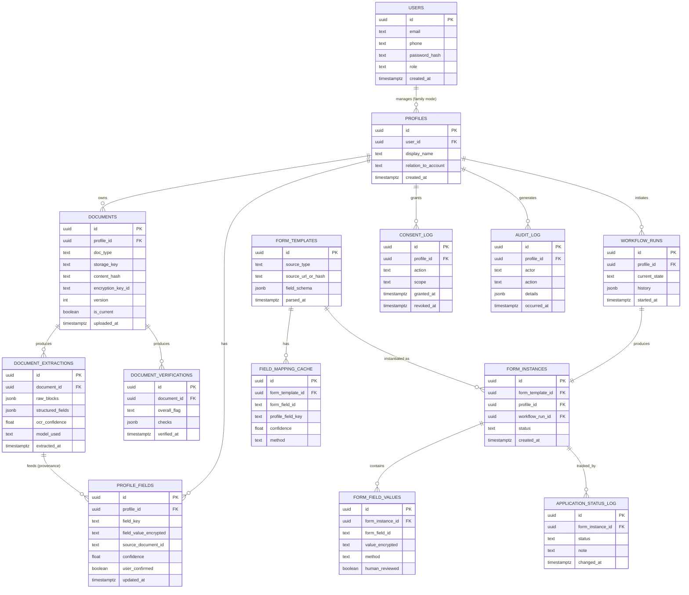

## 6.2 PostgreSQL Schema (Table Definitions + Indexes)

```sql
-- Enable required extensions
CREATE EXTENSION IF NOT EXISTS "uuid-ossp";
CREATE EXTENSION IF NOT EXISTS vector;
CREATE EXTENSION IF NOT EXISTS pgcrypto;

-- ===================== USERS & PROFILES =====================

CREATE TABLE users (
    id UUID PRIMARY KEY DEFAULT uuid_generate_v4(),
    email TEXT UNIQUE,
    phone TEXT UNIQUE,
    password_hash TEXT NOT NULL,
    role TEXT NOT NULL DEFAULT 'user', -- 'user' | 'admin'
    mfa_enabled BOOLEAN NOT NULL DEFAULT false,
    created_at TIMESTAMPTZ NOT NULL DEFAULT now(),
    updated_at TIMESTAMPTZ NOT NULL DEFAULT now(),
    CONSTRAINT email_or_phone CHECK (email IS NOT NULL OR phone IS NOT NULL)
);

CREATE TABLE profiles (
    id UUID PRIMARY KEY DEFAULT uuid_generate_v4(),
    user_id UUID NOT NULL REFERENCES users(id) ON DELETE CASCADE,
    display_name TEXT NOT NULL,
    relation_to_account TEXT NOT NULL DEFAULT 'self', -- 'self' | 'dependent' | 'family_member'
    is_active BOOLEAN NOT NULL DEFAULT true,
    created_at TIMESTAMPTZ NOT NULL DEFAULT now()
);
CREATE INDEX idx_profiles_user_id ON profiles(user_id);

-- ===================== DOCUMENT VAULT =====================

CREATE TABLE documents (
    id UUID PRIMARY KEY DEFAULT uuid_generate_v4(),
    profile_id UUID NOT NULL REFERENCES profiles(id) ON DELETE CASCADE,
    doc_type TEXT NOT NULL, -- AADHAAR, PAN, PASSPORT, DRIVING_LICENSE, MARKSHEET_10, etc.
    storage_key TEXT NOT NULL, -- object storage path (encrypted object)
    content_hash TEXT NOT NULL, -- sha256 for dedup
    encryption_key_id TEXT NOT NULL, -- reference to DEK (see Security section)
    mime_type TEXT NOT NULL,
    size_bytes INT NOT NULL,
    version INT NOT NULL DEFAULT 1,
    is_current BOOLEAN NOT NULL DEFAULT true,
    uploaded_at TIMESTAMPTZ NOT NULL DEFAULT now(),
    expires_hint_at TIMESTAMPTZ -- e.g. income certificate validity
);
CREATE INDEX idx_documents_profile_id ON documents(profile_id);
CREATE INDEX idx_documents_content_hash ON documents(content_hash);
CREATE INDEX idx_documents_profile_type_current ON documents(profile_id, doc_type) WHERE is_current = true;

CREATE TABLE document_extractions (
    id UUID PRIMARY KEY DEFAULT uuid_generate_v4(),
    document_id UUID NOT NULL REFERENCES documents(id) ON DELETE CASCADE,
    raw_blocks JSONB, -- OCR bounding boxes (TTL-pruned, see retention policy)
    structured_fields JSONB NOT NULL, -- {field_key: {value, confidence}}
    ocr_confidence FLOAT,
    model_used TEXT NOT NULL,
    extracted_at TIMESTAMPTZ NOT NULL DEFAULT now()
);
CREATE INDEX idx_doc_extractions_document_id ON document_extractions(document_id);

CREATE TABLE document_verifications (
    id UUID PRIMARY KEY DEFAULT uuid_generate_v4(),
    document_id UUID NOT NULL REFERENCES documents(id) ON DELETE CASCADE,
    overall_flag TEXT NOT NULL, -- 'ok' | 'review' | 'suspicious'
    checks JSONB NOT NULL,
    verified_at TIMESTAMPTZ NOT NULL DEFAULT now()
);
CREATE INDEX idx_doc_verifications_document_id ON document_verifications(document_id);

-- ===================== UNIFIED PROFILE =====================

CREATE TABLE profile_fields (
    id UUID PRIMARY KEY DEFAULT uuid_generate_v4(),
    profile_id UUID NOT NULL REFERENCES profiles(id) ON DELETE CASCADE,
    field_key TEXT NOT NULL, -- canonical key, e.g. 'full_name', 'dob', 'aadhaar_number'
    field_value_encrypted TEXT NOT NULL, -- pgcrypto-encrypted at column level for sensitive keys
    source_document_id UUID REFERENCES documents(id),
    confidence FLOAT NOT NULL DEFAULT 1.0,
    user_confirmed BOOLEAN NOT NULL DEFAULT false,
    updated_at TIMESTAMPTZ NOT NULL DEFAULT now(),
    UNIQUE (profile_id, field_key)
);
CREATE INDEX idx_profile_fields_profile_id ON profile_fields(profile_id);

CREATE TABLE field_embeddings (
    id UUID PRIMARY KEY DEFAULT uuid_generate_v4(),
    field_key TEXT NOT NULL UNIQUE, -- canonical profile field
    description TEXT NOT NULL,
    embedding VECTOR(384) NOT NULL -- e5-small dimension
);
CREATE INDEX idx_field_embeddings_vector ON field_embeddings
    USING hnsw (embedding vector_cosine_ops);

-- ===================== FORMS =====================

CREATE TABLE form_templates (
    id UUID PRIMARY KEY DEFAULT uuid_generate_v4(),
    source_type TEXT NOT NULL, -- 'pdf' | 'web'
    source_url_or_hash TEXT NOT NULL UNIQUE,
    field_schema JSONB NOT NULL,
    scheme_id UUID,
    parsed_at TIMESTAMPTZ NOT NULL DEFAULT now()
);

CREATE TABLE field_mapping_cache (
    id UUID PRIMARY KEY DEFAULT uuid_generate_v4(),
    form_template_id UUID NOT NULL REFERENCES form_templates(id) ON DELETE CASCADE,
    form_field_id TEXT NOT NULL,
    profile_field_key TEXT,
    confidence FLOAT NOT NULL,
    method TEXT NOT NULL, -- 'rule' | 'embedding' | 'llm'
    created_at TIMESTAMPTZ NOT NULL DEFAULT now(),
    UNIQUE (form_template_id, form_field_id)
);

CREATE TABLE form_instances (
    id UUID PRIMARY KEY DEFAULT uuid_generate_v4(),
    form_template_id UUID NOT NULL REFERENCES form_templates(id),
    profile_id UUID NOT NULL REFERENCES profiles(id) ON DELETE CASCADE,
    workflow_run_id UUID,
    status TEXT NOT NULL DEFAULT 'draft', -- draft, filled, awaiting_review, submitted, under_process, approved, rejected
    created_at TIMESTAMPTZ NOT NULL DEFAULT now(),
    submitted_at TIMESTAMPTZ
);
CREATE INDEX idx_form_instances_profile_id ON form_instances(profile_id);
CREATE INDEX idx_form_instances_status ON form_instances(status);

CREATE TABLE form_field_values (
    id UUID PRIMARY KEY DEFAULT uuid_generate_v4(),
    form_instance_id UUID NOT NULL REFERENCES form_instances(id) ON DELETE CASCADE,
    form_field_id TEXT NOT NULL,
    value_encrypted TEXT,
    method TEXT NOT NULL, -- 'rule' | 'embedding' | 'llm' | 'user_manual'
    human_reviewed BOOLEAN NOT NULL DEFAULT false,
    UNIQUE (form_instance_id, form_field_id)
);

-- ===================== WORKFLOW & TRACKING =====================

CREATE TABLE workflow_runs (
    id UUID PRIMARY KEY DEFAULT uuid_generate_v4(),
    profile_id UUID NOT NULL REFERENCES profiles(id) ON DELETE CASCADE,
    current_state TEXT NOT NULL,
    history JSONB NOT NULL DEFAULT '[]',
    started_at TIMESTAMPTZ NOT NULL DEFAULT now(),
    updated_at TIMESTAMPTZ NOT NULL DEFAULT now()
);
CREATE INDEX idx_workflow_runs_profile_id ON workflow_runs(profile_id);

CREATE TABLE application_status_log (
    id UUID PRIMARY KEY DEFAULT uuid_generate_v4(),
    form_instance_id UUID NOT NULL REFERENCES form_instances(id) ON DELETE CASCADE,
    status TEXT NOT NULL,
    note TEXT,
    changed_at TIMESTAMPTZ NOT NULL DEFAULT now()
);
CREATE INDEX idx_app_status_log_instance ON application_status_log(form_instance_id);

-- ===================== CONSENT & AUDIT =====================

CREATE TABLE consent_log (
    id UUID PRIMARY KEY DEFAULT uuid_generate_v4(),
    profile_id UUID NOT NULL REFERENCES profiles(id) ON DELETE CASCADE,
    action TEXT NOT NULL, -- e.g. 'document_upload', 'use_for_form_fill', 'submit_application'
    scope TEXT NOT NULL, -- e.g. document_id or form_instance_id
    granted_at TIMESTAMPTZ NOT NULL DEFAULT now(),
    revoked_at TIMESTAMPTZ
);
CREATE INDEX idx_consent_log_profile_id ON consent_log(profile_id);

CREATE TABLE audit_log (
    id UUID PRIMARY KEY DEFAULT uuid_generate_v4(),
    profile_id UUID REFERENCES profiles(id) ON DELETE SET NULL,
    actor TEXT NOT NULL, -- user_id, 'system:ocr_agent', 'system:orchestrator', etc.
    action TEXT NOT NULL,
    details JSONB,
    occurred_at TIMESTAMPTZ NOT NULL DEFAULT now()
);
CREATE INDEX idx_audit_log_profile_id ON audit_log(profile_id);
CREATE INDEX idx_audit_log_occurred_at ON audit_log(occurred_at);
```

## 6.3 Notes on Relationships & Design Decisions

- `profiles` is a separate entity from `users` specifically to support **Family Mode (FR-14)** — one login can manage multiple isolated profiles, and every downstream table (documents, profile_fields, form_instances) keys off `profile_id`, not `user_id`, enforcing isolation at the schema level rather than just in application logic.
- `field_mapping_cache` is keyed by `form_template_id`, which is the mechanism that makes the cost optimization in Section 5 actually work — it's a real table, not just a Redis cache, so mappings survive restarts and can be audited/corrected.
- Sensitive values (`profile_fields.field_value_encrypted`, `form_field_values.value_encrypted`) use `pgcrypto` column-level encryption in addition to disk-level encryption — see Section 7 for the full envelope-encryption scheme.
- `document_extractions.raw_blocks` is intentionally the most disposable data in the schema (see retention policy in Security section) — it's OCR debugging detail, not something the product needs to keep indefinitely once `structured_fields` is derived and confirmed.

---

# 7. Security Architecture

## 7.1 Encryption at Rest

- **Envelope encryption** for documents: each document object is encrypted with a unique Data Encryption Key (DEK), and DEKs are themselves encrypted by a Key Encryption Key (KEK) held in a secrets manager (self-hosted: HashiCorp Vault, or at minimum environment-isolated KMS-style service — never a hardcoded app secret).
- **Column-level encryption** for sensitive structured fields (Aadhaar number, PAN, DOB, financial figures, address) via `pgcrypto`, independent of disk/volume encryption — so a raw DB dump or backup theft does not expose plaintext PII even if disk encryption is somehow bypassed.
- **Disk-level encryption** (LUKS on the VPS volume, or provider-managed encrypted volumes) as the baseline third layer.
- **Object storage server-side encryption** enabled on MinIO/B2 buckets as a fourth, redundant layer — defense in depth rather than relying on any single layer.

## 7.2 Encryption in Transit

- TLS 1.3 everywhere via Caddy/Nginx + Let's Encrypt; HSTS enabled.
- Internal service-to-service traffic (FastAPI ↔ Celery workers ↔ Postgres ↔ MinIO) runs inside a private Docker network / VPC with no public exposure of internal ports; mTLS between services is a Phase 3+ hardening step once the team scales beyond a single trusted VPS.
- All file uploads streamed directly to encrypted storage; no plaintext temp files persisted to disk longer than the active processing job (and those are written to a `tmpfs`/in-memory volume where feasible, not regular disk).

## 7.3 Zero-Knowledge-Oriented Storage

True end-to-end zero-knowledge (where even the server operator cannot decrypt) is in tension with the product's core function — the OCR/extraction/verification agents *must* read document content to do their job. So instead of claiming full zero-knowledge (which would be misleading), the architecture implements **zero-knowledge-adjacent controls**:
- Per-user DEKs mean a single compromised key exposes only one user's documents, not the whole vault.
- Decrypted document content exists in memory only for the duration of the OCR/extraction job, never written back to disk in plaintext, and is garbage-collected immediately after.
- No human employee has standing access to decrypted document content — any manual support access requires a time-boxed, audit-logged "break-glass" procedure.
- The LLM and OCR models run **inside** the same trust boundary (self-hosted, no third-party API call ever receives document content) — this is the actual privacy guarantee the product can honestly make, and it's architecturally enforced, not just promised in a privacy policy.

## 7.4 RBAC (Role-Based Access Control)

| Role | Permissions |
|---|---|
| `user` (account owner) | Full CRUD on own profiles, documents, forms; cannot access other users' data. |
| `profile_dependent_manager` | Implicit role granted to a `user` for profiles marked `relation_to_account != 'self'` under their account — same permissions as `user` but scoped to that profile only. |
| `support_agent` | Read-only access to non-sensitive metadata (status, timestamps) for support tickets; **no** access to decrypted document content or sensitive profile_fields without a logged break-glass elevation. |
| `admin` | System configuration, form_template management, knowledge-base curation for RAG; explicitly **no** standing access to user document content. |
| `system:<agent_name>` | Service-account identities for each AI agent, scoped to only the tables/operations that agent needs (e.g. `system:ocr_agent` can write to `document_extractions` but cannot write to `form_field_values`). |

RBAC enforced at two levels: API-layer middleware (FastAPI dependency injection checking role+scope per route) **and** Postgres Row-Level Security (RLS) policies on `profile_id`-scoped tables, so a bug in application logic cannot accidentally leak cross-profile data — the database itself refuses the query.

```sql
-- Example RLS policy
ALTER TABLE documents ENABLE ROW LEVEL SECURITY;
CREATE POLICY profile_isolation ON documents
    USING (profile_id = current_setting('app.current_profile_id')::uuid);
```

## 7.5 Audit Logs

- Every read of decrypted sensitive content, every AI agent decision, every consent grant/revocation, and every submission action is written to `audit_log` (Section 6) — append-only (enforced via a Postgres trigger rejecting `UPDATE`/`DELETE` on that table for non-admin roles, and even admin deletes require a separate signed justification record).
- Audit log retention: minimum 1 year (adjustable to match eventual sector-specific regulatory guidance, e.g. financial-form submissions may need longer retention than scholarship forms).

## 7.6 DPDP Act 2023 Compliance (Primary Regime)

India's Digital Personal Data Protection Act, 2023 is the primary compliance target since this product handles Indian government identity documents. Architectural mappings:

- **Consent (Sec. 6)**: Explicit, purpose-specific consent captured per action (`consent_log` table) — not a single blanket "I agree" at signup. Uploading Aadhaar requires a distinct consent event from "use Aadhaar data to fill Form X."
- **Purpose limitation (Sec. 4-5)**: Each `profile_fields` row carries provenance and is only used for the stated purpose (form-filling); no secondary use (e.g. analytics on document content, ad targeting) is implemented or permitted by design.
- **Data minimization**: Gap Detection (FR-10) only asks for fields actually required by the target form — the system does not pre-collect data "in case it's useful later."
- **Storage limitation**: Raw OCR blocks have a short TTL (Section 6.3); documents can be marked for deletion when no longer needed (e.g. an expired income certificate, once a fresher one is uploaded, is retained only as long as the user chooses, with clear deletion controls — not silently kept forever).
- **Right to erasure / withdrawal of consent**: A `DELETE /profiles/{id}` flow (Section 9) performs actual cryptographic erasure — deleting a profile's DEK renders all that profile's encrypted documents permanently unreadable, which is a stronger and faster guarantee than row-by-row deletion across a large system.
- **Significant Data Fiduciary considerations**: Given the volume and sensitivity of identity documents processed, the product should expect to register/operate consistent with Significant Data Fiduciary obligations (data protection officer designation, periodic data audits) as it scales past MVP — flagged here as a Phase 3 organizational requirement, not just a technical one.
- **Data localization**: Government identity document data should be stored on servers located in India (this is both a DPDP-adjacent best practice and avoids ambiguity given sectoral rules for some document types); choose an India-region VPS/object storage provider.
- **Breach notification (Sec. 8(6))**: Incident response runbook required (Phase 2 deliverable) with defined notification timelines to the Data Protection Board and affected users.

## 7.7 GDPR-Compatible Design (Secondary, for non-Indian users)

The same controls above (purpose limitation, consent logging, encryption, erasure-by-key-deletion) satisfy GDPR's core principles (Art. 5, 6, 17, 25 "privacy by design"). Additional GDPR-specific items if the product ever serves EU users: a formal Data Protection Impact Assessment (DPIA) given the special-category-adjacent nature of identity documents, and a `GET /profiles/{id}/export` data portability endpoint (Section 9 includes this).

---

# 8. Agent Workflow (Mermaid Sequences)

## 8.1 Document Upload

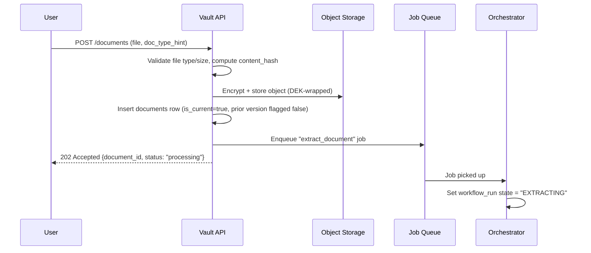

## 8.2 Data Extraction

```mermaid
sequenceDiagram
    participant ORCH as Orchestrator
    participant OCR as OCR Agent
    participant CLS as Classification Agent
    participant VER as Verification Agent
    participant DB as Postgres

    ORCH->>OCR: extract(document_id)
    OCR->>OCR: Decrypt in-memory, run PaddleOCR
    OCR->>DB: Insert document_extractions (raw_blocks, text)
    OCR-->>ORCH: {text, blocks, confidence}

    ORCH->>CLS: classify(text, blocks)
    CLS->>CLS: Rule-pass; if low confidence, call local LLM
    CLS-->>ORCH: {doc_type, confidence}

    ORCH->>VER: verify(document_id, doc_type, text)
    VER->>VER: Run checksum/MRZ/tamper checks
    VER->>DB: Insert document_verifications
    VER-->>ORCH: {overall_flag, checks}

    ORCH->>DB: Update document_extractions.structured_fields
    ORCH->>ORCH: state = "PROFILE_MERGE_PENDING"
```

## 8.3 Profile Creation / Merge

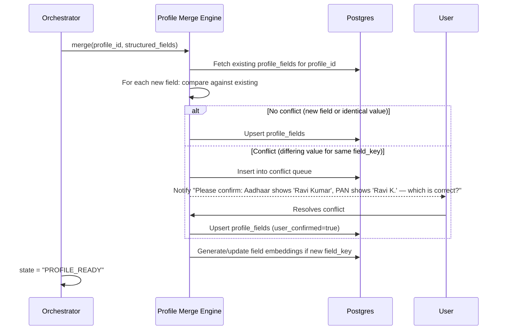

## 8.4 Form Detection

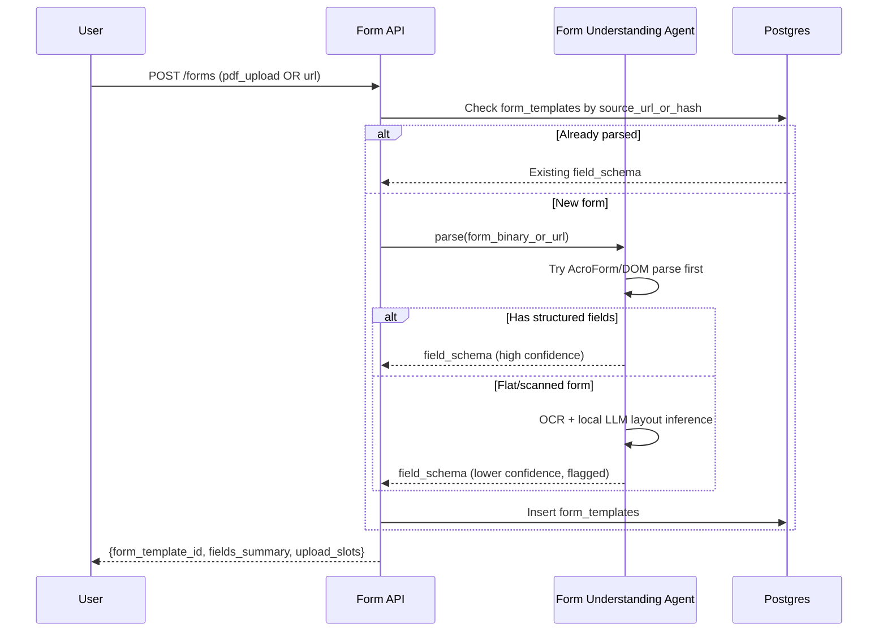

## 8.5 Auto Form Filling

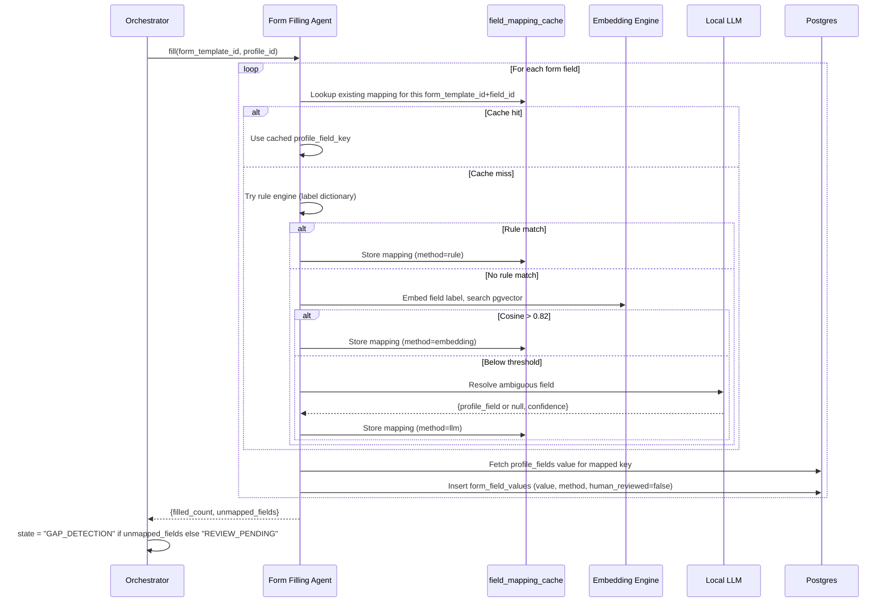

## 8.6 Human Verification

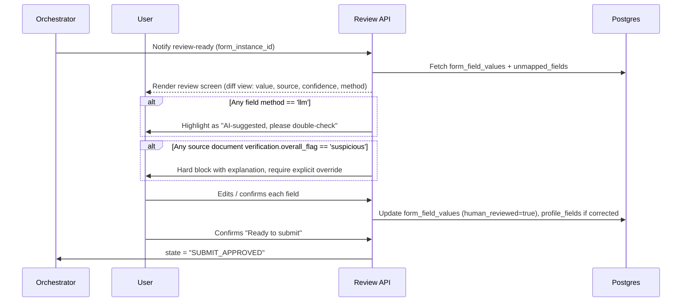

## 8.7 Submission

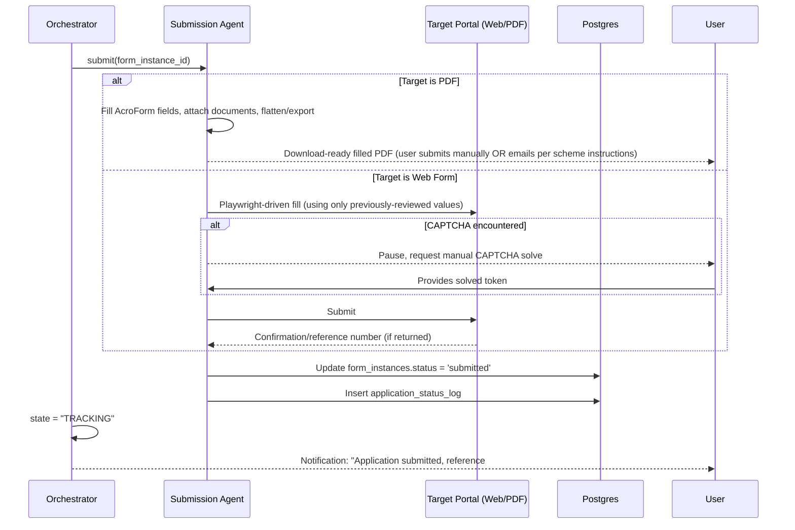

---

# 9. API Design

Base path: `/api/v1`. All endpoints require `Authorization: Bearer <jwt>` except `/auth/*`. All sensitive responses redact full document values unless the `?reveal=true` is passed by the resource owner with re-authentication (step-up auth) within the last N minutes.

## 9.1 Auth

**POST `/auth/register`**
```json
// Request
{ "email": "ananya@example.com", "phone": "+919876543210", "password": "min-12-chars-with-mix" }
// Response 201
{ "user_id": "uuid", "message": "Verification OTP sent to phone" }
```
Validation: email or phone required (at least one); password ≥ 12 chars, checked against a common-password blocklist (not just a regex complexity rule).

**POST `/auth/login`**
```json
// Request
{ "email": "ananya@example.com", "password": "..." }
// Response 200
{ "access_token": "jwt", "refresh_token": "jwt", "expires_in": 900 }
```

## 9.2 Profiles

**POST `/profiles`**
```json
// Request
{ "display_name": "Ananya Sharma", "relation_to_account": "self" }
// Response 201
{ "profile_id": "uuid" }
```

**GET `/profiles/{profile_id}/fields`**
```json
// Response 200
{
  "fields": [
    { "field_key": "full_name", "value": "Ananya Sharma", "confidence": 0.97,
      "source_document_id": "uuid", "user_confirmed": true },
    { "field_key": "aadhaar_number", "value": "XXXX-XXXX-1234", "confidence": 0.99,
      "source_document_id": "uuid", "user_confirmed": false }
  ]
}
```
Validation: caller must own `profile_id` or be its delegated `profile_dependent_manager`; sensitive fields masked by default per the redaction rule above.

**DELETE `/profiles/{profile_id}`** — triggers DPDP right-to-erasure flow (Section 7.6): destroys the profile's DEK, schedules object storage purge, anonymizes audit_log entries (retaining only non-identifying action counts for legal retention requirements).
```json
// Response 202
{ "message": "Erasure initiated. Documents will be unrecoverable within 24 hours." }
```

**GET `/profiles/{profile_id}/export`** — data portability (GDPR Art. 20 / DPDP equivalent).
```json
// Response 200 (application/json or ?format=pdf)
{ "profile": {...}, "documents_metadata": [...], "form_instances": [...] }
```

## 9.3 Documents

**POST `/documents`** (multipart/form-data)
```
file: <binary>
profile_id: uuid
doc_type_hint: "AADHAAR" (optional — system will classify regardless)
```
```json
// Response 202
{ "document_id": "uuid", "status": "processing" }
```
Validation: file size ≤ 15MB; mime type in `{image/jpeg, image/png, application/pdf}`; rate-limited to 30 uploads/hour/profile to deter abuse.

**GET `/documents/{document_id}/status`**
```json
// Response 200
{ "status": "extracted", "doc_type": "AADHAAR", "verification_flag": "ok", "extracted_fields_preview": ["full_name", "dob", "aadhaar_number", "address"] }
```

**GET `/documents?profile_id={id}&doc_type={type}`** — list vault contents (metadata only, no raw content in list view).

## 9.4 Forms

**POST `/forms`**
```json
// Request (URL-based)
{ "profile_id": "uuid", "source_type": "web", "url": "https://scholarship.gov.in/apply/xyz" }
// or (PDF-based, multipart)
{ "profile_id": "uuid", "source_type": "pdf", "file": "<binary>" }
```
```json
// Response 201
{
  "form_template_id": "uuid",
  "fields_summary": { "total": 28, "previously_seen": true },
  "upload_slots": [{ "slot_id": "photo", "max_size_kb": 50, "dimensions": "200x230px", "format": "jpeg" }]
}
```

**POST `/forms/{form_template_id}/fill`**
```json
// Request
{ "profile_id": "uuid" }
// Response 200
{
  "form_instance_id": "uuid",
  "filled_count": 24,
  "unmapped_fields": [
    { "field_id": "f_17", "label": "Preferred Exam Center" },
    { "field_id": "f_22", "label": "Bank Account for Refund" }
  ],
  "status": "awaiting_gap_fill"
}
```

**POST `/forms/instances/{form_instance_id}/gap-fill`**
```json
// Request
{ "values": { "f_17": "Pune Center 2", "f_22": "XXXXXXXXXX1234" } }
// Response 200
{ "status": "ready_for_review" }
```

**GET `/forms/instances/{form_instance_id}/review`**
```json
// Response 200
{
  "fields": [
    { "field_id": "f_03", "label": "Date of Birth", "value": "2005-04-12",
      "method": "rule", "confidence": 0.99, "needs_attention": false },
    { "field_id": "f_09", "label": "Category", "value": "OBC",
      "method": "llm", "confidence": 0.71, "needs_attention": true,
      "reason": "Ambiguous label matched via AI — please verify" }
  ],
  "document_warnings": []
}
```

**POST `/forms/instances/{form_instance_id}/confirm`**
```json
// Request
{ "approved_field_overrides": { "f_09": "OBC-NCL" } }
// Response 200
{ "status": "submit_approved" }
```
Validation: every field with `needs_attention: true` from the review payload must appear either unchanged-and-acknowledged or in `approved_field_overrides` — the API rejects confirmation if flagged fields are silently skipped.

**POST `/forms/instances/{form_instance_id}/submit`**
```json
// Response 202
{ "status": "submitting" }
// Webhook/poll later:
{ "status": "submitted", "reference_number": "SCH2026-998877", "submitted_at": "2026-06-18T10:32:00Z" }
```

## 9.5 Tracking

**GET `/applications?profile_id={id}&status={status}`**
```json
// Response 200
{
  "applications": [
    { "form_instance_id": "uuid", "scheme_name": "Pre-Matric Scholarship 2026",
      "status": "under_process", "submitted_at": "2026-06-10T...", "last_update": "2026-06-15T..." }
  ]
}
```

**PATCH `/applications/{form_instance_id}/status`** (manual update where no portal API exists)
```json
// Request
{ "status": "approved", "note": "Confirmed via SMS from department" }
```

---

# 10. Folder Structure

```
autoformfiller/
├── frontend/
│   ├── public/
│   ├── src/
│   │   ├── api/                     # API client wrappers (typed, generated from OpenAPI)
│   │   ├── components/
│   │   │   ├── vault/                # Document upload, vault grid, doc detail
│   │   │   ├── profile/              # Unified profile view, field provenance UI
│   │   │   ├── forms/                # Form selector, review/diff screen, gap-fill form
│   │   │   ├── tracking/             # Application dashboard, status timeline
│   │   │   └── shared/               # Buttons, modals, consent dialogs
│   │   ├── pages/
│   │   ├── hooks/
│   │   ├── context/                  # Auth context, active-profile (family mode) context
│   │   ├── i18n/                      # en.json, hi.json
│   │   ├── styles/
│   │   └── main.tsx
│   ├── package.json
│   └── vite.config.ts
│
├── backend/
│   ├── app/
│   │   ├── main.py                   # FastAPI app entrypoint
│   │   ├── core/
│   │   │   ├── config.py             # env-based settings
│   │   │   ├── security.py           # JWT, password hashing, RLS session var setter
│   │   │   └── encryption.py         # envelope encryption helpers (DEK/KEK)
│   │   ├── api/
│   │   │   └── v1/
│   │   │       ├── auth.py
│   │   │       ├── profiles.py
│   │   │       ├── documents.py
│   │   │       ├── forms.py
│   │   │       └── applications.py
│   │   ├── models/                   # SQLAlchemy ORM models (mirrors Section 6 schema)
│   │   ├── schemas/                  # Pydantic request/response schemas
│   │   ├── services/
│   │   │   ├── vault_service.py
│   │   │   ├── profile_service.py
│   │   │   ├── form_service.py
│   │   │   └── tracking_service.py
│   │   ├── db/
│   │   │   ├── session.py
│   │   │   └── migrations/           # Alembic
│   │   └── tasks/                    # Celery task definitions, calling into ai_services
│   ├── tests/
│   ├── requirements.txt
│   └── Dockerfile
│
├── ai_services/
│   ├── orchestrator/
│   │   ├── state_machine.py
│   │   └── dispatcher.py
│   ├── ocr_agent/
│   │   ├── paddle_runner.py
│   │   ├── tesseract_fallback.py
│   │   └── preprocess.py             # deskew/denoise
│   ├── classification_agent/
│   │   ├── rules.yaml                # keyword/regex rules per doc type
│   │   └── classifier.py
│   ├── verification_agent/
│   │   ├── checksum_validators.py    # Verhoeff (Aadhaar), MRZ, PAN regex
│   │   └── tamper_heuristics.py
│   ├── form_understanding_agent/
│   │   ├── pdf_acroform_parser.py
│   │   ├── web_dom_parser.py         # Playwright-based
│   │   └── layout_inference_llm.py   # fallback for flat/scanned forms
│   ├── form_filling_agent/
│   │   ├── rule_engine.py
│   │   ├── label_dictionary.yaml      # >500 pre-seeded label->field_key mappings
│   │   ├── embedding_matcher.py
│   │   └── llm_resolver.py
│   ├── rag_agent/
│   │   ├── ingestion/                 # offline scheme-doc scraping & chunking scripts
│   │   ├── retriever.py
│   │   └── synthesizer.py
│   ├── llm_runtime/
│   │   ├── ollama_client.py
│   │   └── prompt_templates/          # .jinja files per agent, matching Section 3
│   └── shared/
│       ├── embeddings.py              # e5-small wrapper
│       └── schemas.py                 # shared pydantic contracts between agents
│
├── database/
│   ├── init/
│   │   └── 001_schema.sql             # Section 6 DDL
│   ├── seed/
│   │   └── label_dictionary_seed.sql
│   └── migrations/                    # Alembic-managed, mirrors backend/app/db/migrations
│
├── infrastructure/
│   ├── docker-compose.yml
│   ├── docker-compose.prod.yml
│   ├── caddy/
│   │   └── Caddyfile
│   ├── monitoring/
│   │   ├── prometheus.yml
│   │   └── grafana/dashboards/
│   ├── vault/                          # HashiCorp Vault config for KEK management
│   └── scripts/
│       ├── backup_postgres.sh
│       └── backup_minio.sh
│
├── .github/
│   └── workflows/
│       ├── backend-ci.yml
│       ├── frontend-ci.yml
│       └── ai-services-ci.yml
│
├── docs/
│   ├── PRD.md                          # this document, split/maintained
│   ├── API.md
│   └── runbooks/
│       └── incident_response.md
│
├── .env.example
└── README.md
```

---

# 11. Development Roadmap

## Phase 1 — MVP (Weeks 1-6)

**Document pipeline milestone (completed):** Upload → encrypt/MinIO → Celery OCR → classify → verify → Aadhaar/PAN field extraction → profile merge → status API (`processing` / `extracted` / `verified` / `failed`). Verified by `backend/tests/test_document_pipeline_e2e.py` and `scratch/test_pipeline.py`.

- Auth (email/phone + password), single profile per user (family mode deferred). ✅
- Document Vault: upload, OCR (PaddleOCR), classification (rules + Ollama fallback), verification (Verhoeff/PAN/MRZ + tamper heuristics), envelope encryption, async Celery pipeline. ✅
- Unified profile: merge service with conflict queue (conflict UI deferred). ✅
- Form Understanding: AcroForm PDF parsing only (web-form parsing deferred to Phase 2). ⏳
- Form Filling: rule engine + embedding matcher; LLM resolver behind a feature flag. ⏳
- Human review screen (mandatory, no skip). ⏳
- Manual-only submission (user downloads filled PDF; no automated web submission yet). ⏳
- Basic application tracker with manual status updates. ⏳
- Target: 3-5 real scholarship/government PDF forms working end-to-end as proof points. ⏳

## Phase 2 — Beta (Weeks 7-14)
- Family Mode (multi-profile per account) with RLS-enforced isolation.
- Verification Agent: full checksum suite (Verhoeff, MRZ, PAN structure) + tamper heuristics.
- Web Form Understanding via Playwright DOM parsing.
- RAG Agent live with a curated knowledge base for ~20-30 common schemes.
- Tiny LLM resolver enabled for ambiguous field mapping, with caching.
- Notification service (status changes, document expiry).
- Conflict-resolution UI for cross-document field disagreements.
- Consent logging fully wired into every sensitive action.
- Closed beta with real users across 2-3 personas; collect mapping-accuracy metrics.

## Phase 3 — Production (Weeks 15-26)
- Automated web-form submission (Playwright-driven), with CAPTCHA-pause-for-human flow.
- DigiLocker / UIDAI-adjacent integration research and (where licensing permits) live verification.
- Significant Data Fiduciary compliance posture: DPO designation, periodic audit process, formal breach-notification runbook.
- Multi-language UI expansion beyond En/Hi based on user base.
- Application status auto-polling for portals that expose a status-check API.
- Hardened secrets management (HashiCorp Vault in production mode, key rotation policy).
- Load testing, backup/restore drills, incident response tabletop exercise.

## Phase 4 — Scale (Month 7+)
- Move object storage to managed cheap-tier provider if self-hosted ops burden grows (Section 14).
- Read replica for Postgres; consider partitioning `audit_log`/`document_extractions` by time.
- Optional GPU-backed LLM serving cluster if latency SLAs demand it.
- Expand RAG knowledge base to hundreds of schemes/forms with a dedicated content-ops process.
- Optional opt-in cloud-LLM tier for power users wanting faster/more-accurate handling of unusual handwritten forms (never default, never required).
- Formal third-party security audit and penetration test before claiming production-grade security publicly.

---

# 12. Antigravity IDE Build Instructions

> Feed this section to Antigravity IDE directly as the execution plan. Each step is ordered so dependencies are satisfied before the steps that need them.

### Step 1 — Repository & folder scaffolding
1. Initialize a monorepo with the folder structure exactly as specified in Section 10.
2. Create `.env.example` with placeholders for: `DATABASE_URL`, `REDIS_URL`, `MINIO_ENDPOINT`, `MINIO_ACCESS_KEY`, `MINIO_SECRET_KEY`, `JWT_SECRET`, `KEK_VAULT_PATH`, `OLLAMA_HOST`, `OCR_LANG=en+hi`.
3. Initialize git, add a `.gitignore` covering `node_modules`, `__pycache__`, `.env`, model weight caches (`*.gguf`, `paddleocr_models/`).

### Step 2 — Docker Compose (development)
4. Generate `infrastructure/docker-compose.yml` with services: `postgres` (image `pgvector/pgvector:pg16`, volume-mounted, env-configured), `redis`, `minio` (+ a one-shot `minio-init` container that creates the default bucket on first boot), `backend` (build from `backend/Dockerfile`), `celery-worker` (same image as backend, different entrypoint command), `ollama` (official `ollama/ollama` image, volume-mounted model cache), `frontend` (Vite dev server), `caddy` (reverse proxy, routes `/api` to backend, `/` to frontend).
5. Ensure `postgres` service runs `database/init/001_schema.sql` automatically on first container start via the standard `docker-entrypoint-initdb.d` mount.
6. Add healthchecks for `postgres`, `redis`, `minio`, `ollama` so dependent services wait correctly (`depends_on: condition: service_healthy`).

### Step 3 — PostgreSQL setup
7. Write `database/init/001_schema.sql` containing exactly the DDL from Section 6.2 (extensions, all tables, all indexes).
8. Write the RLS policy migration (Section 7.4 example) as a follow-up SQL file, applied after table creation.
9. Set up Alembic in `backend/app/db/migrations/` with `alembic.ini` pointing at `DATABASE_URL`; generate an initial migration that matches the SQL schema (used for all *future* schema changes — the SQL init file is the source of truth for first boot, Alembic for everything after).
10. Seed `field_embeddings` table: for each canonical profile field (full_name, dob, aadhaar_number, pan_number, father_name, mother_name, address, etc.), generate its e5-small embedding offline and insert via `database/seed/label_dictionary_seed.sql`.

### Step 4 — Backend (FastAPI) bootstrap
11. Scaffold `backend/app/main.py` with FastAPI app, CORS middleware (restricted to frontend origin), `prometheus-fastapi-instrumentator` wired for `/metrics`.
12. Implement `core/config.py` using `pydantic-settings` reading from environment.
13. Implement `core/security.py`: password hashing (argon2), JWT issuance/verification, a FastAPI dependency `get_current_profile` that sets the Postgres session variable `app.current_profile_id` (for RLS) on every request.
14. Implement `core/encryption.py`: envelope encryption helpers — `generate_dek()`, `wrap_dek(dek, kek)`, `unwrap_dek(...)`, `encrypt_field(value, dek)`, `decrypt_field(value, dek)`.
15. Scaffold SQLAlchemy models in `models/` mirroring every table in Section 6.2 exactly (field names must match the SQL schema 1:1).
16. Scaffold Pydantic schemas in `schemas/` mirroring the request/response bodies in Section 9.
17. Implement the API routers (`api/v1/auth.py`, `profiles.py`, `documents.py`, `forms.py`, `applications.py`) per the endpoint specs in Section 9, including the stated validation rules (file size/mime checks, password policy, RLS-aware ownership checks, the "flagged fields must be acknowledged" confirm-endpoint rule).

### Step 5 — Authentication
18. Implement `/auth/register`, `/auth/login`, `/auth/refresh` per Section 9.1.
19. Wire OTP-based phone verification (stub provider interface — log OTP to console in dev, swap to a real SMS provider only at production deployment, keeping cost at zero in dev/test).
20. Add rate limiting on auth endpoints (Redis-backed sliding window) to mitigate credential stuffing.

### Step 6 — Document Vault & Storage
21. Implement `vault_service.py`: on upload, compute `sha256` content hash, check for existing identical document (dedup), generate per-document DEK, encrypt, stream to MinIO, insert `documents` row, enqueue Celery task `extract_document`.
22. Configure MinIO bucket lifecycle policy for the short-TTL raw-OCR-blocks cleanup job (separate from document objects themselves, which persist until user deletion).

### Step 7 — AI Services: OCR & Classification
23. Build `ai_services/ocr_agent/` wrapping PaddleOCR (`en+hi`) with `tesseract_fallback.py` as a secondary path if PaddleOCR confidence is low or it errors.
24. Build `ai_services/classification_agent/rules.yaml` with keyword/regex patterns for each doc type listed in Section 3.2; implement `classifier.py` to try rules first, then call the local LLM (Section 3.2 prompt template) via `ollama_client.py` only on low confidence.
25. Wire both into the Celery task `extract_document`, persisting results to `document_extractions` and `document_verifications`.

### Step 8 — AI Services: Verification
26. Implement `checksum_validators.py`: Verhoeff algorithm for Aadhaar, PAN regex+category-code check, MRZ checksum for passports (standard ICAO 9303 check-digit algorithm).
27. Implement `tamper_heuristics.py`: ELA-based heuristic for JPEGs, font-consistency check, EXIF metadata inspection — combine into an `overall_flag` per Section 3.5.

### Step 9 — Profile Merge Engine
28. Implement the merge logic described in Section 8.3: upsert on no-conflict, conflict-queue row + user notification on disagreement, embedding generation for any newly-seen `field_key`.

### Step 10 — AI Services: Form Understanding & Filling
29. Implement `pdf_acroform_parser.py` (use `pypdf`/`pikepdf` to read AcroForm fields directly) and `web_dom_parser.py` (Playwright headless browser, extract labeled form elements).
30. Implement `layout_inference_llm.py` as the fallback path for flat/scanned PDFs, using the OCR Agent's output and the Section 3.3 prompt template.
31. Implement the three-tier Form Filling Agent exactly as the router diagram in Section 5.1 and sequence in Section 8.5: rule engine (YAML dictionary lookup) → embedding matcher (pgvector cosine search) → LLM resolver (cached per `form_template_id` in `field_mapping_cache`).
32. Pre-seed `label_dictionary.yaml` with at least 500 common Indian-form label variants (English + Hindi) mapped to canonical `field_key`s, covering the document types in the project description.

### Step 11 — RAG Agent
33. Build the offline ingestion pipeline (`rag_agent/ingestion/`): scripts to fetch/curate scheme guideline documents, chunk them, embed with e5-small, store in a dedicated `rag_chunks` table (add this table to the schema: `id, scheme_id, source_url, chunk_text, embedding VECTOR(384)`).
34. Implement `retriever.py` (pgvector similarity search) and `synthesizer.py` (constrained-context LLM call per Section 3.6's prompt template).

### Step 12 — Orchestrator
35. Implement the Workflow Orchestrator as an explicit state machine (Python `transitions` library or hand-rolled), with states matching: `UPLOADED → EXTRACTING → VERIFYING → PROFILE_MERGE_PENDING → PROFILE_READY → FORM_DETECTED → MAPPING → GAP_DETECTION → REVIEW_PENDING → SUBMIT_APPROVED → SUBMITTING → SUBMITTED → TRACKING`.
36. Hardcode the mandatory-human-review trigger rules from Section 3.7 directly in the state machine's transition guards — these must not be configurable via LLM output.

### Step 13 — LLM Runtime Setup
37. Pull and configure Ollama with `qwen2.5:7b-instruct-q4_K_M` as the primary model; document the `ollama pull` commands in a setup script (`infrastructure/scripts/setup_models.sh`).
38. Implement `ollama_client.py` as a thin wrapper enforcing: short max-token responses for classification/mapping tasks (cost/latency control), JSON-mode/grammar-constrained output where the Ollama version supports it, and a request timeout with graceful fallback (return `null`/`unmapped` rather than hanging) if the model is overloaded.

### Step 14 — Frontend
39. Scaffold the React app per Section 10's structure; implement the Document Vault upload UI, the Unified Profile view (showing field, value, source, confidence — masking sensitive fields by default with a reveal toggle requiring re-auth), the Form review/diff screen (highlighting `method: llm` fields per Section 8.6), and the Application Tracking dashboard.
40. Implement the consent dialog component used before every sensitive action (document upload, "use this document to fill a form," submission) — this should call the consent-logging backend endpoint, not just be a UI-only checkbox.
41. Add i18n scaffolding (`en.json`, `hi.json`) from day one even if Hindi strings are initially incomplete — retrofitting i18n later is expensive.

### Step 15 — Security Hardening Pass
42. Apply the RLS policies (Section 7.4) to every `profile_id`-scoped table.
43. Set up HashiCorp Vault (or documented equivalent) for KEK storage; ensure no KEK or DEK ever appears in logs (add a logging filter that redacts any field matching key-like patterns as a safety net).
44. Wire the `audit_log` append-only trigger (reject `UPDATE`/`DELETE` for non-admin roles).

### Step 16 — Monitoring
45. Add Prometheus scrape config for backend `/metrics` and Celery worker metrics (via `celery-exporter` or similar); build starter Grafana dashboards for request latency, queue depth, and LLM call counts (the latter is your primary cost-tracking proxy even though calls are local/free — queue depth and LLM call volume tell you if the caching strategy in Section 5 is actually working).

### Step 17 — Testing & CI
46. Write unit tests for: checksum validators (known-good/known-bad Aadhaar/PAN test vectors), the rule engine label dictionary, RLS policy enforcement (attempt cross-profile access, expect denial), and the orchestrator's mandatory-review trigger guards.
47. Set up GitHub Actions workflows (`backend-ci.yml`, `frontend-ci.yml`, `ai-services-ci.yml`) running lint + tests on every PR.

### Step 18 — Seed Data & Demo Path
48. Seed 2-3 real (or realistic synthetic) scholarship/government PDF forms as `form_templates` so the system has something to demonstrate end-to-end immediately after setup.
49. Provide a `make demo` or `docker-compose -f docker-compose.yml up` one-command path that brings up the full stack with seeded data, documented in `README.md`.

---

# 13. Challenges & Solutions

| Challenge | Solution Implemented in This Architecture |
|---|---|
| **Dynamic forms** — government/institutional forms change layout without notice, or show/hide fields conditionally based on prior answers. | `form_templates` are hashed by source (URL or PDF content hash) and re-parsed when the hash changes, not cached forever; the Form Understanding Agent re-runs automatically if a previously-known form's structure no longer matches the cached `field_schema` (detected via field-count/label mismatch on re-render). Conditional fields are handled by the Playwright-based web parser re-querying the DOM after each fill step, not assuming a static field list captured once. |
| **CAPTCHA handling** | The architecture explicitly does **not** attempt to auto-solve CAPTCHAs (this would be both technically fragile and legally/ethically questionable on government sites). Instead, Section 8.7's submission sequence pauses and hands control back to the human for CAPTCHA-only, resuming the automated flow once solved — CAPTCHA-solving services or bypass techniques are deliberately out of scope. |
| **Government website changes** | Form templates are versioned, not assumed static; the system tracks a `parsed_at` timestamp and a lightweight scheduled job re-validates high-traffic form templates periodically, flagging ones that fail re-validation for admin review rather than silently serving stale field mappings to users. |
| **Security risks** | Addressed structurally in Section 7: envelope encryption, RLS, column-level encryption for the most sensitive fields, append-only audit log, no third-party model calls ever touching document content, and a documented (not just claimed) break-glass procedure for any human support access. |
| **Hallucinations** (the LLM inventing a field mapping or fabricating a value) | The LLM is never the source of a *value* — it only ever selects which existing, already-extracted profile field should fill a given form slot, or declares "no match." It cannot invent new field values. Combined with the mandatory-human-review rule for any LLM-sourced mapping (Section 3.7) and the RAG Agent's "don't guess, say you don't know" prompt constraint (Section 3.6), hallucination risk is contained to "wrong field selected," which a human catches at review — not "fabricated personal data," which the architecture makes structurally impossible. |
| **Storage optimization** | Content-hash deduplication, image re-compression on ingest, short-TTL raw OCR blocks, shared (not per-user) model weights, pgvector instead of a separate vector database — all detailed in Section 5.3. |
| **Cost optimization** | Local-only LLM inference, form-template-level mapping cache (the dominant cost lever at scale), tiered fallback architecture where the LLM is the last resort not the first call, self-hosted auth/monitoring/vector-search instead of paid SaaS equivalents — detailed in Section 5.4. |
| **Multilingual documents** (most Indian ID documents are bilingual, sometimes with regional-language third scripts) | PaddleOCR configured for `en+hi` as baseline; the label dictionary (Section 10, Step 10) includes Hindi label variants; the embedding model (`multilingual-e5-small`) was specifically chosen because it handles cross-lingual similarity, so a Hindi form label can still match an English canonical field description. |
| **Low digital literacy users** (Persona: Suresh) | The Gap Detection flow (FR-10) is intentionally minimal — only the fields with no confident mapping are ever shown — and the mandatory human-review screen (Section 8.6) is designed as a simple diff/confirm view, not a raw JSON-like dump, with consent dialogs in plain language rather than legal boilerplate. |
| **Family/multi-profile data isolation** (Persona: Rakesh) | Enforced at the database layer via Postgres RLS (Section 7.4), not just UI-level profile switching — a bug in frontend state management cannot leak one relative's Aadhaar into another's session because the database itself rejects cross-profile queries. |
| **Document authenticity claims overreaching legally** | The Verification Agent's output is explicitly framed as a non-binding consistency/flag signal (`ok`/`review`/`suspicious`), never an authoritative "this document is genuine" certification — protecting both users (false confidence) and the product (liability) from an AI system making legal authenticity determinations it has no authority to make. |

---

# 14. Scaling Strategy

## 14.1 At 10,000 users
- **Infra**: Single mid-tier VPS (8 vCPU / 32GB RAM / 200GB SSD) is sufficient for Postgres + Redis + MinIO + backend + Celery workers + Ollama (CPU inference acceptable at this volume — most requests resolve via rule engine/cache, hitting the LLM rarely).
- **Database**: Single Postgres instance, no read replica needed yet. pgvector indexes (`hnsw`) handle the embedding volume (well under 1M vectors) trivially.
- **Bottleneck to watch**: LLM-call latency during burst periods (e.g. scholarship deadline days). Mitigation: queue-based async processing (Celery) so user-facing requests never block on a slow LLM call — the UI shows "processing" and polls/websocket-updates rather than holding a synchronous request open.

## 14.2 At 100,000 users
- **Infra**: Split into at least 3 hosts: (1) application+API host, (2) database host (Postgres, possibly with one read replica for reporting/analytics queries so they don't compete with transactional load), (3) AI/Ollama host — ideally with a modest GPU (e.g. a single consumer-grade 12-16GB GPU) to keep LLM-resolver latency acceptable, since the absolute number of cache-miss LLM calls grows even though the *rate per user* shrinks (more form templates have already been cached by then, partially offsetting growth).
- **Storage**: Migrate object storage from self-hosted MinIO to a managed cheap tier (Backblaze B2 or equivalent India-region provider) if self-hosted ops burden (backups, disk monitoring, RAID) becomes a real time cost — this is a pure infrastructure swap behind the same S3-compatible API, zero application code changes required given the architecture's choice in Section 4.
- **Database**: Consider table partitioning for `audit_log` and `document_extractions` (time-based partitions) since these grow unboundedly and are append-heavy/read-rarely.
- **Caching**: Redis cache layer in front of `field_mapping_cache` reads (hot path for every form-fill) to reduce Postgres read load.

## 14.3 At 1,000,000 users
- **Infra**: Move to container orchestration (K3s or managed Kubernetes) for the application and AI-service layers, enabling horizontal autoscaling of stateless services (backend API pods, Celery workers, OCR workers) independently from the stateful tier.
- **Database**: Postgres with multiple read replicas; consider Citus or a managed Postgres-compatible distributed offering if write throughput on `profile_fields`/`form_field_values` becomes a bottleneck — but note that at this scale, the *form_template* cache should mean LLM-tier calls per active user are now quite rare (most popular forms long since cached), so the AI layer doesn't need to scale linearly with user count, only with *new/unique form templates* encountered, which grows much more slowly.
- **AI layer**: Dedicated GPU cluster (a handful of GPUs) running Ollama or a more throughput-oriented serving stack (e.g. vLLM, still self-hosted/open-source) behind a load balancer, with the same Qwen2.5/Llama models — still no mandatory paid API dependency, the architecture's core cost guarantee holds even at this scale.
- **Object storage**: At this volume, negotiate a dedicated India-region storage contract or a multi-region setup if the user base is geographically distributed, with lifecycle policies moving older/inactive documents to cheaper cold storage tiers.
- **Compliance**: This scale almost certainly crosses into Significant Data Fiduciary territory under DPDP — by this point the Phase 3 organizational compliance work (DPO, periodic audits) is not optional and should be a board-level tracked item, not an engineering backlog item.
- **Observability**: Move from single-node Prometheus to a federated/remote-write setup (e.g. Thanos or Mimir) so metrics retention and query performance keep up with the larger fleet.

---

# 15. Hackathon Version (24-48 Hours)

A simplified slice that still demonstrates the full pipeline end-to-end — Upload → Extract → Verify (lightweight) → Profile → Detect Form → Map/Fill → Review → "Submit" (simulated) — without the production hardening.

## What to build
1. **Single FastAPI backend**, no separate AI-service layer split — keep OCR/classification/filling logic as plain Python functions called directly (no Celery, synchronous for the demo).
2. **SQLite or a single local Postgres container** (skip the full schema — just `documents`, `profile_fields`, `form_templates`, `form_field_values`; drop multi-profile/family mode, RLS, and audit logging for the demo).
3. **OCR**: Tesseract only (skip PaddleOCR setup overhead) — `pytesseract` with `eng+hin`.
4. **Classification**: Rules only (regex/keyword), skip the LLM fallback — pick 4-5 document types to support well (Aadhaar, PAN, Marksheet, Passport-style photo+signature) rather than all 11 from the project description.
5. **Verification**: Implement just the Aadhaar Verhoeff checksum and PAN regex check — these are fast wins that look impressive in a demo ("we validate the actual government checksum algorithm") without needing the full tamper-heuristics suite.
6. **Form Filling**: Rule engine (label dictionary) + embedding matcher only; skip the LLM resolver tier entirely for the hackathon (pre-curate 1-2 demo forms where rules+embeddings achieve high coverage, so the gap-fill screen has a short, convincing list rather than a long one).
7. **One real target form**: Pick one actual scholarship or government PDF with AcroForm fields (many NSP/scholarship PDFs qualify) and get that one working perfectly — a single flawless end-to-end run beats a half-working generic system in a demo.
8. **Frontend**: A single-page React app — Upload screen → Profile view → "Select form" → Review/diff screen → "Submit" button that just marks `status = submitted` in the DB and shows a mock reference number (no real Playwright web-submission automation; that's the part most likely to break live and least essential to convey the vision).
9. **Skip entirely for the hackathon**: family mode, RAG Agent, real web-form Playwright automation, HashiCorp Vault (use a simple env-var key for encryption demo purposes, clearly noted as "production would use envelope encryption with Vault, simplified here for time"), monitoring stack, CI/CD.
10. **Keep visible even in the simplified build**: the consent dialog before upload/use (judges notice privacy-by-design), the confidence/source labels on every profile field (shows the provenance story), and the explicit human-review screen before "submission" (shows you understood that auto-submission without review is the wrong default, even under time pressure).

## Suggested 36-hour split (for a 48-hour hackathon, leaving slack)
- **Hours 0-6**: Repo scaffold, Postgres simplified schema, FastAPI skeleton, basic auth (or skip auth entirely and hardcode a single demo user — judges rarely care about auth in a 48h demo).
- **Hours 6-16**: OCR + classification + checksum verification working for 3-4 document types end-to-end, profile_fields populated correctly.
- **Hours 16-26**: Form Understanding (AcroForm parser) + Form Filling (rule engine + embeddings) against your one chosen real target form.
- **Hours 26-32**: Frontend screens — upload, profile, review/diff, mock-submit.
- **Hours 32-40**: Integration pass, fix the inevitable breakage where two pieces don't actually agree on field names, polish the review screen since that's what judges will stare at longest.
- **Hours 40-48**: Demo script rehearsal, README, slack time for the thing that always breaks 2 hours before the deadline.

This subset still demonstrates every core claim in the project description — secure storage, automatic extraction, a unified profile, auto-fill with gap detection, and a human-in-the-loop review — just scoped to one document set and one real form instead of eleven document types and arbitrary forms.

---

*End of specification. This document is structured so each numbered section can also be pasted independently into Antigravity IDE as a standalone prompt if you prefer an incremental build-and-review workflow rather than a single massive generation pass — Section 12 (Build Instructions) is written to reference the other sections by number for exactly that reason.*
